# Profit Splitter Smart Contract with Solidity

The following smart contracts were built to automate financial operations creating efficiencies and increasing transparency for a company.

* `AssociateProfitSplitter.sol` Pay your Associate-level employees quickly and easily.
    * Kovan Testnet Address: `0x52742670e8C96ed9790c265B365DA17990Bb6A63`
* `TieredProfitSplitter.sol` Distribute profits to different tiers of employees.
    * Kovan Testnet Address: `0xd1D90442b0bc06219e085BBea488Ea2C904a11EB`
* `DeferredEquityPlan.sol` Distribute company shares for employees in a "deferred equity incentive plan" automatically.
    * Kovan Testnet Address: `0x8C5fe2c2B01Ec56ba907474819caDBA180B460ad`

### Prerequisites

* [Remix IDE](https://remix.ethereum.org) to write the contracts
* [Ganache](https://www.trufflesuite.com/ganache) a personal Ethereum blockchain for development and testing
* [MetaMask](https://metamask.io/download.html) a crypto wallet and extension for accessing Ethereum enabled distributed applications (Dapps)
pointed to `localhost:8545` or the `Kovan Testnet Network`


### The Associate Profit Splitter Contract

This contract will accept Ether into the contract and divide the Ether evenly among the associate level employees. This will allow the Human Resources department to pay employees quickly and efficiently.

Define each associate employee as a `public` variable set to `payable`:

```
contract AssociateProfitSplitter {
    address payable employee_one;
    address payable employee_two;
    address payable employee_three;
```

Create a constructor function that accepts each employee address variable. Set the employee addresses equal to the parameter values to avoid hardcoding the employee addresses.

```
    constructor(address payable _one, address payable _two, address payable _three) public {
        employee_one = _one;
        employee_two = _two;
        employee_three = _three;
    }
```

Next, create a `balance` and `deposit` function. 

* `balance` returns the contract's current balance. Since we should always be sending Ether to the beneficiaries, this function should always return 0. If it does not, the `deposit` function is not handling the remainders properly and should be fixed. This serves as a test function.

```
    function balance() public view returns(uint) {
        return address(this).balance;
    }
```

* `deposit` should be set to `public payable` ensuring that only the owner can call the function. Set a `uint amount` to equal `msg.value / 3;` to calculate the split value of the Ether. Transfer the `amount` to each employee. Since `uint` only contains positive whole numbers, and Solidity does not fully support float/decimals, we must deal with a potential remainder at the end of this function since `amount` will discard the remainder during division. Transfer the `msg.value - amount * 3` back to `msg.sender`. This will re-multiply the `amount` by 3, then subtract it from the `msg.value` to account for any leftover wei, and send it back to Human Resources.

```
    function deposit() public payable {
        uint amount = msg.value / 3;

        employee_one.transfer(amount);
        employee_two.transfer(amount);
        employee_three.transfer(amount);

        msg.sender.transfer(msg.value - amount * 3);
    }
```

Lastly, `function() external payable` is created as a fallback function to ensure that the logic in `deposit` executes if Ether is sent directly to the contract. This is important to prevent Ether from being locked in the contract since there is no `withdraw` function in this use-case.

```
    function() external payable {
        deposit();
    }
```
#### Testing the contract

The final `AssociateProfitSplitter.sol` contract will look like the below image after compiling in Remix and deploying the contract with employee addresses added. Environment should be set to `Injected Web3`. MetaMask (pointed to `localhost:8545`) will dropdown with a menu to confirm this transaction/deployment.

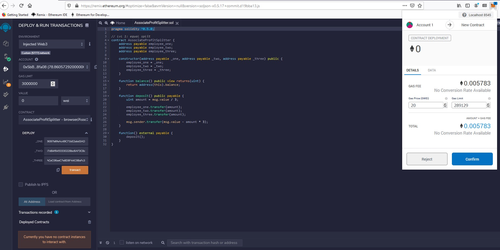

To test the `deposit` function a value of 1 ETH was sent.

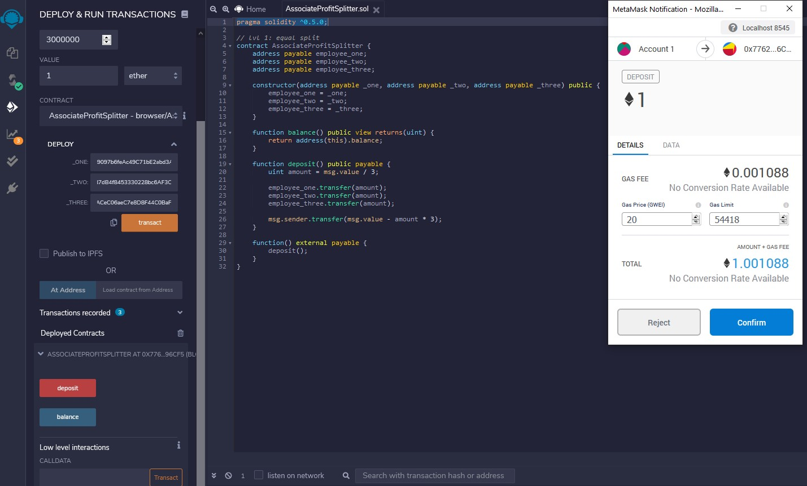

Monitoring the employee address balances in Ganache you can see the 1 ETH was split evenly between 3 associate employees showing the contract is executing properly.

##### Balances Before
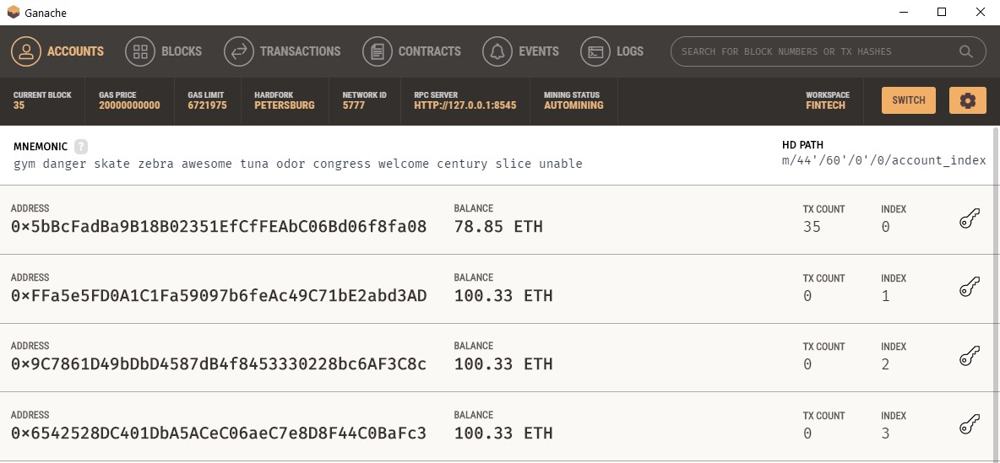

##### Balances After
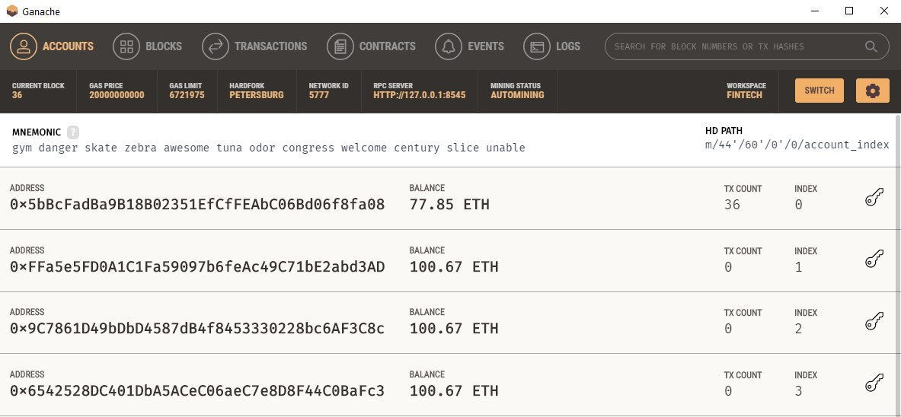


### Tiered Profit Splitter Contract

This contract will distribute different percentages of incoming Ether to employees at different tiers/levels. The following example was tested: the employee_one gets paid 60%, employee_two 25%, and employee_three gets 15%.

Within the `deposit` function calculate the number of points/units by dividing `msg.value` by 100. This will allow us to multiply the points with a number representing a percentage. The `uint amount` variable will be used to store the amount to send each employee temporarily. For each employee, set the `amount` to equal the number of `points` multiplied by the percentage (for example 60 for 60%). After calculating the `amount` for the first employee, add the `amount` to the `total` to keep a running total of how much of the `msg.value` has been distributed so far. Transfer the temporary `amount` to the first employee and repeat the steps for each employee. Send the remainder to the employee with the highest percentage by subtracting `total` from `msg.value`, and sending that to an employee.

```
    function deposit() public payable {
        uint points = msg.value / 100; // Calculates rudimentary percentage by dividing msg.value into 100 units
        uint total;
        uint amount;

        // Calculate and transfer the distribution percentage
        // Step 1: Set amount to equal `points` * the number of percentage points for this employee
        amount = points * 60;
        // Step 2: Add the `amount` to `total` to keep a running total
        total += amount;
        // Step 3: Transfer the `amount` to the employee
        employee_one.transfer(amount);

        amount = points *25;
        total += amount;
        employee_two.transfer(amount);
        
        amount = points *15;
        total += amount;
        employee_three.transfer(amount);  

        employee_one.transfer(msg.value - total); // ceo gets the remaining wei
    }
```

#### Testing the contract

Deploy the contract following the same instructions as the Associate Profit Splitter.

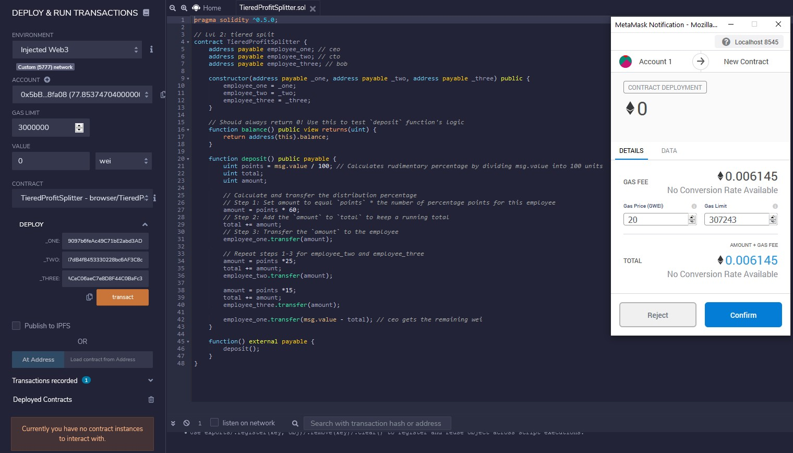

Test the contract functionality by depositing various Ether values (greater than 100 wei).

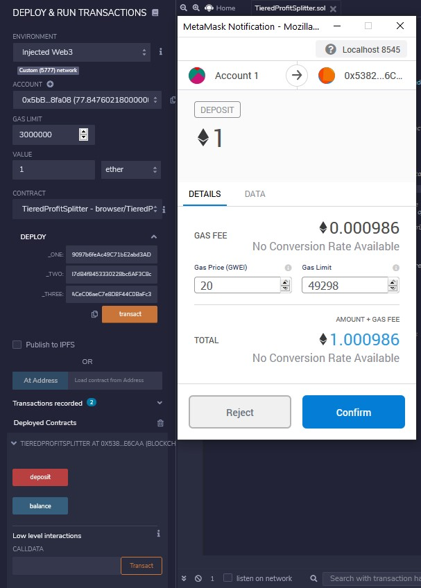

The provided `balance` function can be used as a test to see if the logic you have in the `deposit` function is valid. Since all of the Ether should be transferred to employees, this function should always return `0`, since the contract should never store Ether itself.

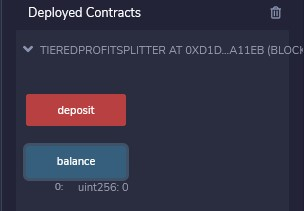


### Deferred Equity Plan Contract

Kovan Testnet Address: `0x8C5fe2c2B01Ec56ba907474819caDBA180B460ad`

This contract will mimic a traditional company's deferred equity incentive plan. It will automatically manage 1000 shares with an annual distribution of 250 over 4 years for a single employee.

Human Resources will be set in the constructor as the `msg.sender`, since HR will be deploying the contract. Create a `uint` called `total_shares` and set this to 1000. Create another `uint` called `annual_distribution` and set this to 250. This equates to a 4 year vesting period for the `total_shares`, as 250 will be distributed per year.

  ```
    uint total_shares = 1000;
    unit annual_distribution = 250;
  ```

The `uint start_time = now;` line permanently stores the contract's start date and will be used to calculate the vested shares later. The `uint public distributed_shares` will track how many vested shares the employee has claimed and was distributed. By default, this is 0.

```
uint start_time = now;

uint public distributed_shares;
```

For the `distribute` function the following requirements need to be added.

* Require that `unlock_time` is less than or equal to `now`.
* Require that `distributed_shares` is less than the `total_shares` the employee was set for.
* Include error messages in your `require` statements.

After the `require` statements, add `365 days` to the `unlock_time`. This will calculate next year's unlock time before distributing this year's shares. Set the new value for `distributed_shares` by calculating how many years have passed since `start_time` multiplied by `annual_distributions`. Finish with an if statement that ensures the contract does not reward more than the `total_shares` agreed upon in the contract.

```
    function distribute() public {
        require(msg.sender == human_resources || msg.sender == employee, "You are not authorized to execute this contract.");
        require(active == true, "Contract not active.");

        // Add "require" statements to enforce that:
        require(unlock_time <= now,  "Account is locked!");

        // `distributed_shares` is less than the `total_shares`
        require(distributed_shares < total_shares, "Available shares have already been distributed.");

        // Add 365 days to the `unlock_time`
        unlock_time += 365 days;

        // Calculate the shares distributed by using the function (now - start_time) / 365 days * the annual distribution
        distributed_shares = (now - start_time) / 365 days * annual_distribution;

        // double check in case the employee does not cash out until after 5+ years
        if (distributed_shares > 1000) {
            distributed_shares = 1000;
        }
    }
```

As a final step add a new variable called `uint fakenow = now;` as the first line of the contract, then replace every other instance of `now` with `fakenow`. Utilize this `fastforward` function to "fast forward" time by 100 days when the contract is deployed.

```
function fastforward() public {
    fakenow += 100 days;
}
```

After deploying the contract click `distributed_shares`. You will see the starting amount is 0 because the vesting period has not been met for any shares to be distributed.
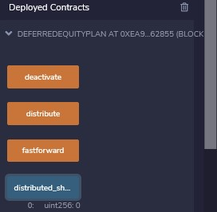

Click `fastforward` four times to pass the 365 day threshold.
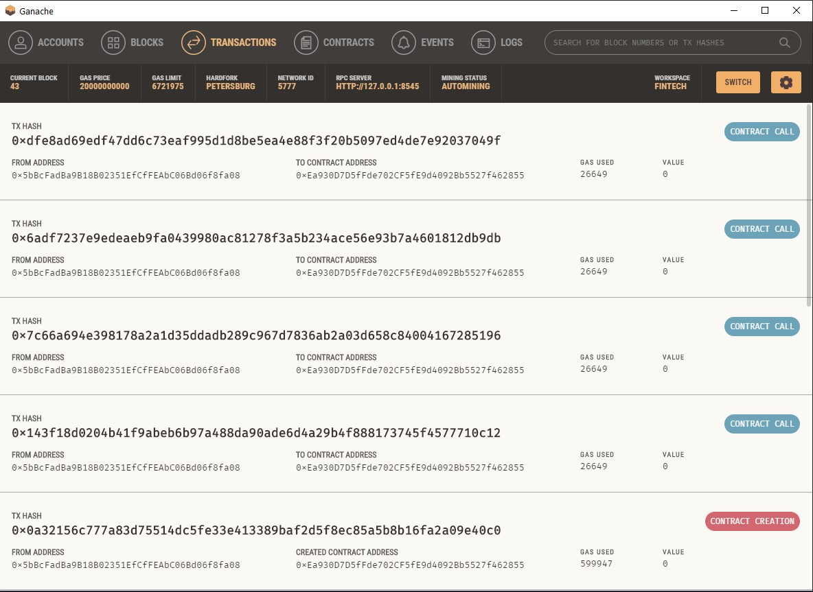

After clicking `fastforward` four times, click `distribute`, and finally click `distributed_shares` to see that 250 shares have been distributed now that 400 days have passed.
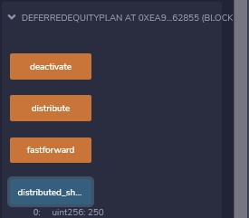

Under the Activity tab of the MetaMask you will see all transations from Contract Deployment to Contract Interaction to Distributions.
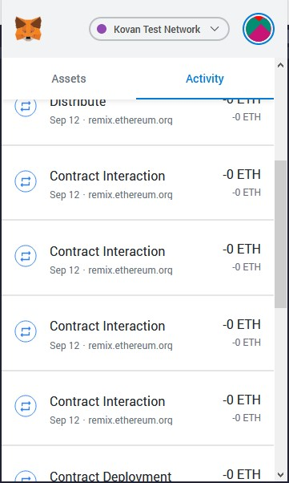


### Deploy the contracts to a live Testnet

Point MetaMask to the Kovan Testnet Network. Use a faucet such as https://faucet.kovan.network/ the ensure you have test Ether on this network. Deploy the contracts as before. The transactions will appear in your MetaMask history and remain on the blockchain permanently to explore later!

Using [Etherscan](https://kovan.etherscan.io) you can confirm that these contracts deployed and the interactions executed properly on the Kovan Testnet Network.


>##### Associate Profit Splitter Contract
>   * https://kovan.etherscan.io/tx/0x7c90bd3171cdb8783f49d72911efa6642b520dcf7eb99ae2d0c7e45226d518b9
>##### Tiered Profit Splitter
>   * https://kovan.etherscan.io/tx/0x891e176138a1153a1ebe7cd85e86f183fb3b392dcde5b305121a71b050154377
>##### Deferred Equity Plan Contract
>   * https://kovan.etherscan.io/tx/0x2722daff3234f2c5264fb431ab90275e433a001b691613478c842070ed335e98